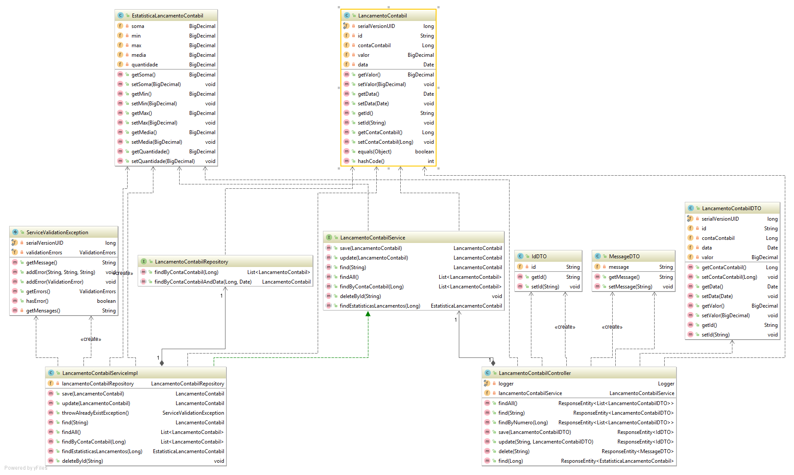

# Lancamentos contabeis - Simple springboot + mongoDB application

### To run!
mvn package spring-boot:run

### Endpoints documentation

* [http://localhost:8080/financeiro/swagger-ui.html](http://localhost:8080/financeiro/swagger-ui.html)

### Tests

* Run with junit to test some demo testcases.

### Class Diagram

### MongoDB Embebbed Config.
* Database: test
* Collections: lancamentos-contabeis
* url: localhost
* port: 12345

### Used tools

[Swagger](https://swagger.io)

[Spring Boot](http://projects.spring.io/spring-boot/)

[Spring Data](http://projects.spring.io/spring-data/)

[MongoDB](https://www.mongodb.com/)

[embedmongo-spring](https://github.com/jirutka/embedmongo-spring)

[de.flapdoodle.embed.mongo](https://github.com/flapdoodle-oss/de.flapdoodle.embed.mongo)

[Dozer mapping](http://dozer.sourceforge.net)

[Mockito](http://site.mockito.org)

[Junit](https://junit.org)

	

